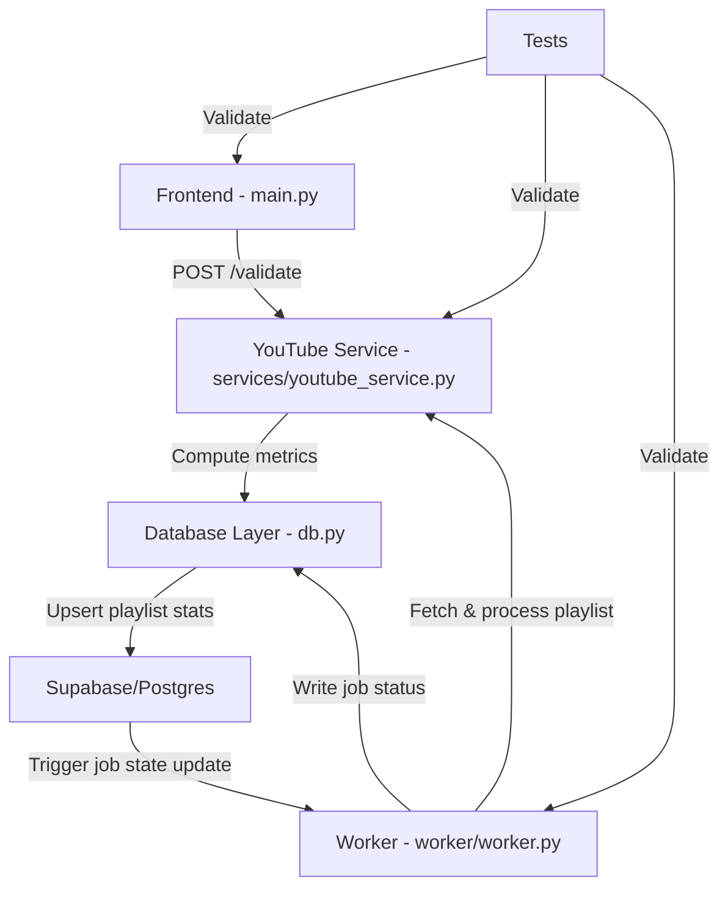
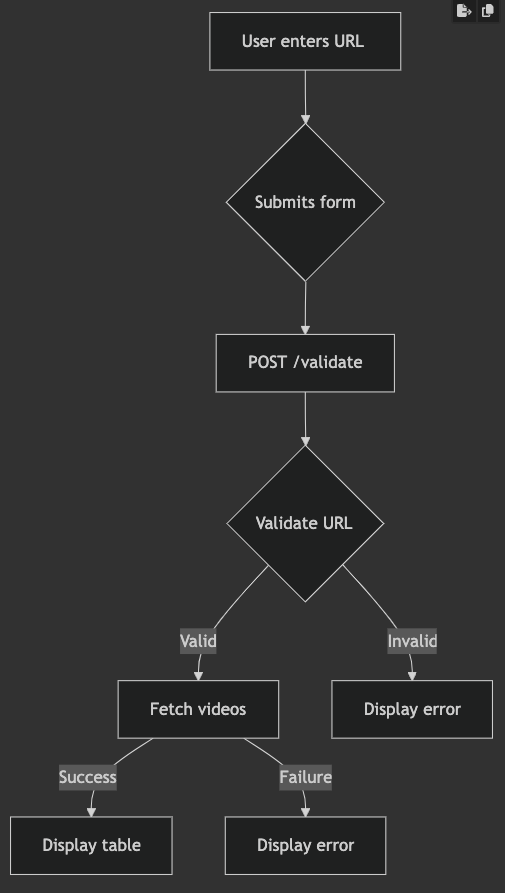
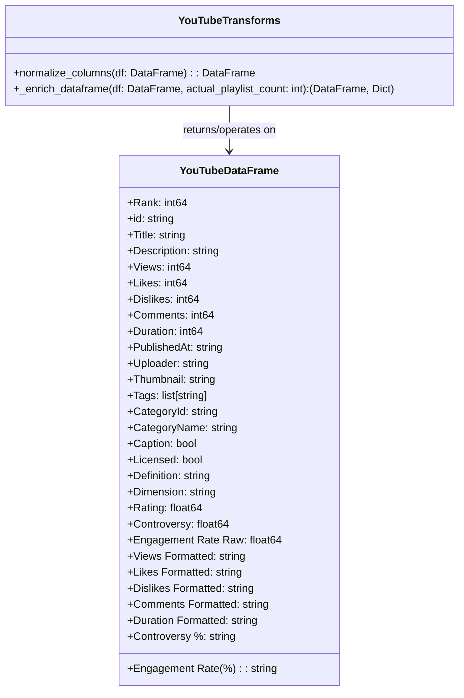

# 🎬 ViralVibes - YouTube Trends, Decoded

A web application that analyzes YouTube playlists to uncover viral trends and engagement patterns. Built with FastHTML and MonsterUI for a modern, responsive interface.

[](https://vercel.com/new/clone?repository-url=https://github.com/vercel/examples/tree/main/framework-boilerplates/fasthtml&template=fasthtml)

_Live Example: https://www.viralvibes.fyi_

## Features

- 🔍 Analyze any YouTube playlist for viral trends
- 📊 View detailed engagement metrics and statistics
- 🎯 Calculate engagement rates and performance indicators
- 📱 Responsive design with modern UI components
- 🔒 Secure newsletter signup with Supabase integration

## Technology Stack

### Frontend
- **FastHTML** – Server-side HTML rendering framework
- **MonsterUI** – UI component library
- **TailwindCSS** – Utility-first CSS framework
- **HTMX** – For real-time updates and client-driven interactivity

### Backend & Data Processing
- **Python** – Core language
- **yt-dlp** – Tool for retrieving YouTube data
- **Polars** – Fast DataFrame library for data manipulation
- **Supabase** – Used for user data, analytics, and storage

### Deployment
- **Vercel** – Platform used for deployment; supports one-click deploy or CLI usage via `vercel --prod`

## Getting Started

1. Clone the repository:
```bash
git clone https://github.com/navneeth/viralvibes.git
cd viralvibes
```

2. Install dependencies:
```bash
uv venv --python 3.11.6
source .venv/bin/activate
uv pip install -r requirements.txt
```

3. Set up environment variables:
```bash
cp .env.example .env
# Edit .env with your Supabase credentials
```

4. Run locally:
```bash
python main.py
```
The development server will start at http://0.0.0.0:5001

## CLI Usage

ViralVibes includes a CLI tool for local development and debugging. Here are the main commands:

### Process Individual Playlists

Test playlist processing with either backend:

```bash
# Local debug with yt-dlp backend
python cli.py process "https://youtube.com/playlist?list=PLxxxxx" --backend yt-dlp

# Local test with YouTube API backend
python cli.py process "https://youtube.com/playlist?list=PLxxxxx" --backend youtubeapi
```

Additional CLI options:
- `--dry-run`: Run without updating the database
- `--help`: Show all available options

### Worker Commands

```bash
# List pending jobs
python cli.py pending

# Run the worker loop (like on Render)
python cli.py run --poll-interval 10 --batch-size 3 --max-runtime 300
```

## Architecture

The application follows a modern serverless architecture with three main layers:

### Frontend Layer
- FastHTML for server-side rendering
- MonsterUI components for modern UI
- Responsive design with TailwindCSS
- Real-time updates with HTMX

### Backend Layer
- Python-based API endpoints
- YouTube data processing with yt-dlp
- Polars for efficient data manipulation
- Supabase integration for data storage

### Data Layer
- Supabase for user data and analytics
- Real-time data processing
- Secure data storage
- Efficient caching mechanisms

### Key Files and Responsibilities
- **[youtube_service.YoutubePlaylistService](https://github.com/navneeth/viralvibes/blob/main/services/youtube_service.py)**: Core service for handling YouTube playlist data retrieval and processing, located in the `services` package due to its heavy logic.
- **[worker.py](https://github.com/navneeth/viralvibes/blob/main/worker.py)**: Manages the job loop, handles job processing, and interacts with the database for task scheduling and execution.
- **[db.py](https://github.com/navneeth/viralvibes/blob/main/db.py)**: Contains Supabase helper functions for database operations, including caching and upsert mechanisms.
- **[components.py](https://github.com/navneeth/viralvibes/blob/main/components.py)**: Defines MonsterUI components for building the application's user interface.
- **[main.py](https://github.com/navneeth/viralvibes/blob/main/main.py)**: Handles web requests and composes the UI using FastHTML for server-side rendering.
- **[tests/](https://github.com/navneeth/viralvibes/tree/main/tests)**: Directory containing test suites with good coverage, though dependent on global environment and configuration settings.





## DataFrame schema (expected columns)

The YouTube service returns a Polars DataFrame with the canonical columns below. Code expects these exact names and types when reading/processing playlist results.

| Column | Type | Description |
|---|---:|---|
| Rank | int64 | Position in playlist (1-based) |
| id | string | YouTube video ID (e.g. `dQw4w9WgXcQ`) |
| Title | string | Video title |
| Description | string | Video description |
| Views | int64 | View count |
| Likes | int64 | Like count |
| Dislikes | int64 | Always 0 (YouTube API no longer returns dislikes) |
| Comments | int64 | Comment count |
| Duration | int64 | Duration in seconds |
| PublishedAt | string | ISO publish date (e.g. `2023-05-12T15:30:00Z`) |
| Uploader | string | Channel name |
| Thumbnail | string | URL to high-res thumbnail |
| Tags | list[string] | List of tags |
| CategoryId | string | YouTube category ID |
| CategoryName | string | Human-readable category (e.g. `Music`) |
| Caption | boolean | True if captions/subtitles exist |
| Licensed | boolean | True if licensed content |
| Definition | string | `hd` or `sd` |
| Dimension | string | `2d` or `3d` |
| Rating | float64 | Reserved / typically null |

Place this section near "Key Files and Responsibilities" or under the "Data Layer" section so it's visible to contributors and tests.

#### Class diagram for DataFrame normalization and enrichment changes




## Deployment

Deploy to Vercel with one click using the button above, or use the CLI:

```bash
npm install -g vercel
vercel --prod
```

## Contributing

Contributions are welcome! Fork the repository, open a branch, and submit a PR.

## License

This project is licensed under the MIT License - see the LICENSE file for details.

## Acknowledgments

- [FastHTML](https://fastht.ml/) for the web framework
- [MonsterUI](https://monsterui.dev/) for UI components
- [Supabase](https://supabase.io/) for backend services
- [Vercel](https://vercel.com) for deployment

## Pre-commit hooks

This repository uses pre-commit to run linters and formatters locally before commits.

Quick setup (run once after cloning):

```bash
pip install pre-commit
pre-commit install
```

Run all hooks against the repository (useful for CI or one-time fixes):

```bash
pre-commit run --all-files
```

Notes
- The hook configuration lives in `.pre-commit-config.yaml` at the repo root.
- Common hooks include formatters and linters (e.g., black/isort/ruff/mypy), plus basic checks (trailing-whitespace, end-of-file-fixer).
- In CI, run `pre-commit run --all-files` to ensure code meets the repo hooks before merging.
