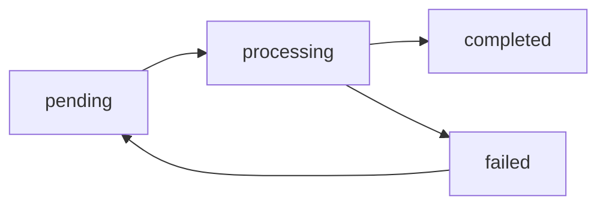

# ViralVibes Database Schema

This directory contains database migrations, schema documentation, and related database utilities.

## Directory Structure

```
db/
├── migrations/          # Sequential SQL migrations
│   ├── README.md
│   └── 003_add_growth_tracking_columns.sql
├── schema/             # Schema documentation and exports (future)
└── README.md           # This file
```

## Database: Supabase (PostgreSQL)

**Provider:** Supabase  
**Engine:** PostgreSQL 15+  
**Authentication:** Row Level Security (RLS) enabled  

## Tables Overview

| Table | Purpose | Row Count (approx) | Key Features |
|-------|---------|-------------------|--------------|
| `creators` | YouTube channel metadata and stats | Growing | Core entity, synced by worker |
| `creator_sync_jobs` | Background sync job queue | Transient | Job status tracking |
| `playlist_stats` | Video-level analytics from playlists | Large | Detailed video metrics |

---

## Table: `creators`

**Primary Table:** Stores YouTube creator/channel information with current stats and growth tracking.

### Schema

| Column | Type | Nullable | Default | Description |
|--------|------|----------|---------|-------------|
| `id` | uuid | NO | `gen_random_uuid()` | Primary key |
| `channel_id` | text | YES | - | YouTube channel ID (UCxxxx...) - **UNIQUE** |
| `channel_name` | text | YES | - | Display name of the channel |
| `channel_url` | text | YES | - | Full YouTube channel URL |
| `channel_description` | text | YES | - | Channel bio/description |
| `custom_url` | text | YES | - | Channel @handle or custom URL slug |
| `custom_url_available` | text | YES | - | Whether custom URL is available |
| | | | | |
| **Current Stats** | | | | |
| `current_subscribers` | bigint | YES | - | Current subscriber count |
| `current_view_count` | bigint | YES | - | Total lifetime views |
| `current_video_count` | integer | YES | - | Total published videos |
| `engagement_score` | numeric | YES | - | Calculated engagement rate (0-100) |
| `quality_grade` | varchar | YES | - | Content quality grade (A+, A, B+, B, C) |
| | | | | |
| **30-Day Growth Tracking** | | | | |
| `subscribers_change_30d` | bigint | YES | `0` | Net subscriber change (NULL = tracking initializing) |
| `views_change_30d` | bigint | YES | `0` | Net view change (NULL = tracking initializing) |
| `videos_change_30d` | integer | YES | `0` | Net video change (NULL = tracking initializing) |
| `prev_subscribers` | bigint | YES | - | Baseline subscriber count for delta calculation |
| `prev_view_count` | bigint | YES | - | Baseline view count for delta calculation |
| `prev_video_count` | integer | YES | - | Baseline video count for delta calculation |
| `prev_snapshot_at` | timestamptz | YES | - | When baseline snapshot was taken |
| | | | | |
| **Channel Metadata** | | | | |
| `channel_thumbnail_url` | text | YES | - | Main channel avatar URL |
| `channel_thumbnail_default` | text | YES | - | Default thumbnail URL |
| `banner_image_url` | text | YES | - | Channel banner/header image |
| `published_at` | timestamp | YES | - | When channel was created |
| `channel_age_days` | integer | YES | - | Days since channel creation (computed) |
| `country_code` | varchar | YES | - | Creator's country (ISO 2-letter code) |
| `default_language` | text | YES | - | Primary content language (ISO code) |
| `official` | boolean | YES | - | Official artist/brand channel |
| `hidden_subscriber_count` | boolean | YES | - | Whether subscriber count is hidden |
| | | | | |
| **Content Categories** | | | | |
| `keywords` | text | YES | - | Channel keywords/tags |
| `topic_categories` | text | YES | - | YouTube topic categories (Wikipedia URLs, JSON array) |
| `primary_category` | text | YES | - | Main content category (e.g., "Gaming") |
| `primary_category_id` | text | YES | - | YouTube category ID |
| `category_distribution` | jsonb | YES | - | Video category breakdown histogram |
| | | | | |
| **Activity Metrics** | | | | |
| `monthly_uploads` | double precision | YES | - | Average uploads per month (trailing 90 days) |
| `featured_channels_count` | integer | YES | - | Number of featured channels |
| `featured_channels_urls` | text | YES | - | URLs of featured channels |
| | | | | |
| **Sync Management** | | | | |
| `sync_status` | varchar | YES | `'pending'` | Sync state: pending, synced, invalid, failed |
| `last_synced_at` | timestamptz | YES | - | Last successful worker sync |
| `last_updated_at` | timestamp | YES | `now()` | Last DB update timestamp |
| `sync_error_message` | text | YES | - | Error message if sync failed |
| | | | | |
| **Discovery Metadata** | | | | |
| `first_seen_at` | timestamp | YES | `now()` | When creator was first added to DB |
| `discovered_at` | timestamp | YES | `now()` | Discovery timestamp |
| `source` | varchar | YES | `'user_playlist'` | How creator was discovered |
| `source_rank` | integer | YES | - | Ranking in source (e.g., playlist position) |
| `description` | text | YES | - | Additional description |

### Indexes

- `UNIQUE INDEX` on `channel_id` (prevents duplicates)
- Index on `sync_status` (worker job queries)
- Index on `last_synced_at` (for refresh queries)

### Constraints

- `CHECK (sync_status IN ('pending', 'synced', 'invalid', 'failed'))`

### Foreign Keys

- Referenced by `creator_sync_jobs.creator_id`
- Referenced by `playlist_stats.creator_id`

### Growth Tracking Logic

**Baseline Snapshot (every 30 days):**
1. Worker fetches current stats from YouTube API
2. Compares to `prev_*` baseline values
3. Calculates 30-day changes
4. After 30 days, updates baseline with current values

**States:**
- `NULL` changes = "Tracking initializing" (< 7 days of baseline data)
- `0` changes = Legitimate zero growth
- `+/-N` changes = Actual growth/decline

---

## Table: `creator_sync_jobs`

**Job Queue:** Tracks background sync tasks for creator stats updates.

### Schema

| Column | Type | Description |
|--------|------|-------------|
| `id` | serial | Job ID (primary key) |
| `creator_id` | uuid | Foreign key to `creators.id` |
| `status` | varchar | Job status: pending, processing, completed, failed |
| `retry_count` | integer | Number of retry attempts |
| `retry_at` | timestamptz | When to retry (for backoff) |
| `error_message` | text | Error details if failed |
| `created_at` | timestamptz | Job creation time |
| `updated_at` | timestamptz | Last status update |

### Job States



- **pending**: Ready to be picked up by worker
- **processing**: Currently being synced
- **completed**: Successfully synced (job deleted after completion)
- **failed**: Sync failed, will retry with exponential backoff

### Worker Behavior

- Polls for `status='pending' AND (retry_at IS NULL OR retry_at <= NOW())`
- Batch size: configurable (default 10)
- Retry backoff: exponential (base 2 seconds, max 5 attempts)

---

## Table: `playlist_stats`

**Video Analytics:** Detailed video-level metrics extracted from user playlists.

### Schema (Key Columns)

| Column | Type | Description |
|--------|------|-------------|
| `id` | uuid | Primary key |
| `creator_id` | uuid | Foreign key to `creators.id` |
| `video_id` | text | YouTube video ID |
| `title` | text | Video title |
| `view_count` | bigint | Video views |
| `like_count` | bigint | Video likes |
| `comment_count` | integer | Comment count |
| `duration` | integer | Video duration (seconds) |
| `published_at` | timestamptz | Upload date |
| `category_id` | text | YouTube category ID |
| `category_name` | text | Category name |

---

## Common Queries

### Get creators needing sync

```sql
SELECT id, channel_id, channel_name, last_synced_at
FROM creators
WHERE sync_status = 'pending'
   OR (sync_status = 'synced' AND last_synced_at < NOW() - INTERVAL '30 days')
ORDER BY last_synced_at NULLS FIRST
LIMIT 50;
```

### Get creators with active growth

```sql
SELECT 
    channel_name,
    current_subscribers,
    subscribers_change_30d,
    ROUND((subscribers_change_30d::numeric / NULLIF(current_subscribers - subscribers_change_30d, 0) * 100), 2) as growth_rate
FROM creators
WHERE subscribers_change_30d IS NOT NULL
  AND subscribers_change_30d > 0
ORDER BY growth_rate DESC
LIMIT 20;
```

### Get creators by quality grade

```sql
SELECT quality_grade, COUNT(*) as count
FROM creators
WHERE quality_grade IS NOT NULL
GROUP BY quality_grade
ORDER BY quality_grade;
```

### Find creators needing baseline initialization

```sql
SELECT COUNT(*) 
FROM creators
WHERE prev_snapshot_at IS NULL
  AND current_subscribers IS NOT NULL;
```

---

## Maintenance

### Vacuum and Analyze

```sql
-- After large data imports or updates
VACUUM ANALYZE creators;
VACUUM ANALYZE creator_sync_jobs;
```

### Cleanup old completed jobs

```sql
-- Remove jobs completed more than 7 days ago
DELETE FROM creator_sync_jobs
WHERE status = 'completed'
  AND updated_at < NOW() - INTERVAL '7 days';
```

---

## Migrations

Migrations are located in `db/migrations/` and should be run sequentially.

See [db/migrations/README.md](migrations/README.md) for migration instructions.

### Current Migrations

1. **001_add_growth_tracking_columns.sql** - Add 30-day growth tracking

---

## Environment Variables

```bash
# Supabase connection (from .env)
NEXT_PUBLIC_SUPABASE_URL=https://xxx.supabase.co
NEXT_PUBLIC_SUPABASE_ANON_KEY=eyJxxx...
SUPABASE_SERVICE_ROLE_KEY=eyJxxx...  # For admin operations
```

---

## Related Files

- **db.py**: Database client initialization and helper functions
- **worker/creator_worker.py**: Background sync worker
- **services/channel_utils.py**: YouTube API integration
- **constants.py**: Table names and constants

---

## Schema Dump

To export the current schema:

```bash
# Full schema
pg_dump $DATABASE_URL --schema-only > db/schema/full_schema.sql

# Specific table
pg_dump $DATABASE_URL --schema-only --table=creators > db/schema/creators.sql
```

---

## Support

For schema changes or database issues, see:
- Migration guide: [db/migrations/README.md](migrations/README.md)
- Issue tracker: GitHub Issues
- Worker logs: Check worker output for sync errors
