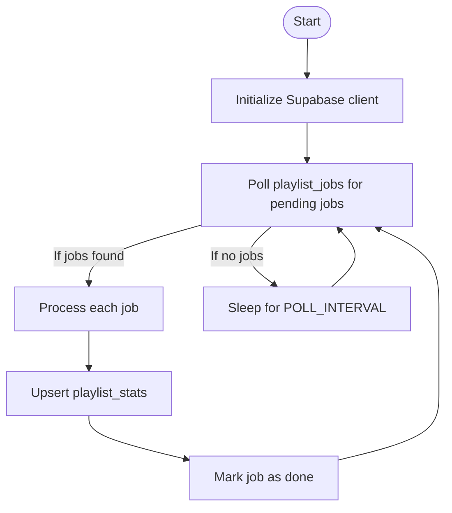

# ViralVibes Worker Flowchart

```mermaid
flowchart TD
    Start([Start]) --> InitSupabase["Initialize Supabase client"]
    InitSupabase --> PollJobs["Poll playlist_jobs for pending jobs"]
    PollJobs -->|If jobs found| ProcessJobs["Process each job"]
    ProcessJobs --> UpdateStats["Upsert playlist_stats"]
    UpdateStats --> MarkDone["Mark job as done"]
    PollJobs -->|If no jobs| Sleep["Sleep for POLL_INTERVAL"]
    MarkDone --> PollJobs
    Sleep --> PollJobs
```